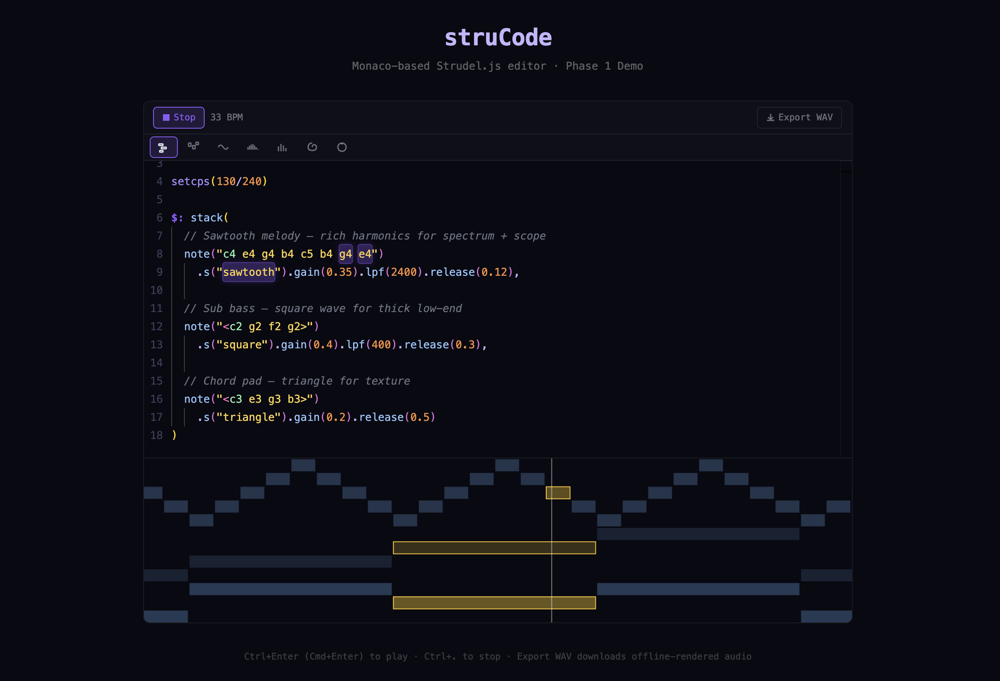

<div align="center">

# struCode



**A professional Monaco-based editor for [Strudel.js](https://strudel.cc) — built as an embeddable React component library.**

[](LICENSE)
[](https://www.typescriptlang.org/)
[](https://react.dev/)
[](https://strudel.cc)

</div>

---

## Overview

struCode is the editor that [strudel.cc](https://strudel.cc) should have had. It replaces the default strudel web component with a Monaco-powered editing experience — tightly integrated with `@strudel/core` and `@strudel/webaudio` (no iframe boundary), designed to be embedded in any React application.

---

## Features

| Feature | Status |
|---------|--------|
| Active note highlighting — source chars glow in sync with the audio scheduler | ✅ |
| Sound autocompletion — `s("...")` suggests all Dirt-Samples and synth names | ✅ |
| Runtime error surfacing — scheduler-time errors appear in the editor, not just the console | ✅ |
| WAV export — offline fast-render via `OfflineAudioContext` (50× realtime) | ✅ |
| Multi-stem export — render each pattern to a separate WAV in parallel | ✅ |
| Monaco language support — syntax highlighting, bracket matching, keyboard shortcuts | ✅ |
| Inline pianoroll embedded between code lines | Planned |
| Oscilloscope, spectrum analyser, spiral, pitchwheel visualizers | Planned |
| Hover docs and error squiggles | Planned |

---

## Repo structure

```
struCode/
├── packages/
│   ├── editor/          # @strucode/editor — React component library (tsup)
│   │   └── src/
│   │       ├── StrudelEditor.tsx       # Root component
│   │       ├── engine/
│   │       │   ├── StrudelEngine.ts    # Wraps @strudel/core + @strudel/webaudio
│   │       │   ├── HapStream.ts        # Event bus — emits haps as they are scheduled
│   │       │   ├── OfflineRenderer.ts  # OfflineAudioContext fast render
│   │       │   ├── LiveRecorder.ts     # Live capture → WAV Blob
│   │       │   └── WavEncoder.ts       # AudioBuffer → WAV Blob (zero deps)
│   │       └── monaco/
│   │           ├── StrudelMonaco.tsx   # Monaco editor wrapper
│   │           ├── language.ts         # Strudel language tokens + config
│   │           └── useHighlighting.ts  # Hap → Monaco decoration hook
│   └── app/             # Next.js 16 demo app (Turbopack)
```

---

## Getting started

**Prerequisites:** Node 18+, pnpm 9+

```bash
git clone https://github.com/MrityunjayBhardwaj/struCode.git
cd struCode
pnpm install
pnpm dev          # http://localhost:3000
```

---

## Usage

```tsx
import { StrudelEditor } from '@strucode/editor'

export default function App() {
  return (
    <StrudelEditor
      defaultCode={`$: note("c3 e3 g3 b3").s("sine").gain(0.7)`}
      height={400}
      onPlay={() => console.log('playing')}
      onStop={() => console.log('stopped')}
      onError={(err) => console.error(err)}
    />
  )
}
```

### Key props

| Prop | Type | Description |
|------|------|-------------|
| `code` | `string` | Controlled code value |
| `defaultCode` | `string` | Initial uncontrolled code |
| `onChange` | `(code: string) => void` | Code change callback |
| `onPlay` / `onStop` | `() => void` | Playback lifecycle callbacks |
| `onError` | `(err: Error) => void` | Eval and runtime error callback |
| `onExport` | `(blob: Blob) => Promise<string>` | Custom export handler (e.g. CDN upload) |
| `theme` | `'dark' \| 'light' \| StrudelTheme` | Editor theme |
| `engineRef` | `MutableRefObject<StrudelEngine>` | Direct engine access |

---

## Stack

- **Editor** — [Monaco Editor](https://microsoft.github.io/monaco-editor/) via `@monaco-editor/react`
- **Audio** — [Strudel](https://strudel.cc) (`@strudel/core`, `@strudel/webaudio`, `@strudel/mini`, `@strudel/tonal`, `@strudel/xen`, `@strudel/midi`, `@strudel/soundfonts`)
- **Framework** — React 19, Next.js 16 (Turbopack)
- **Tooling** — TypeScript, pnpm workspaces, tsup, Vitest

---

## License

MIT — see [LICENSE](LICENSE)
