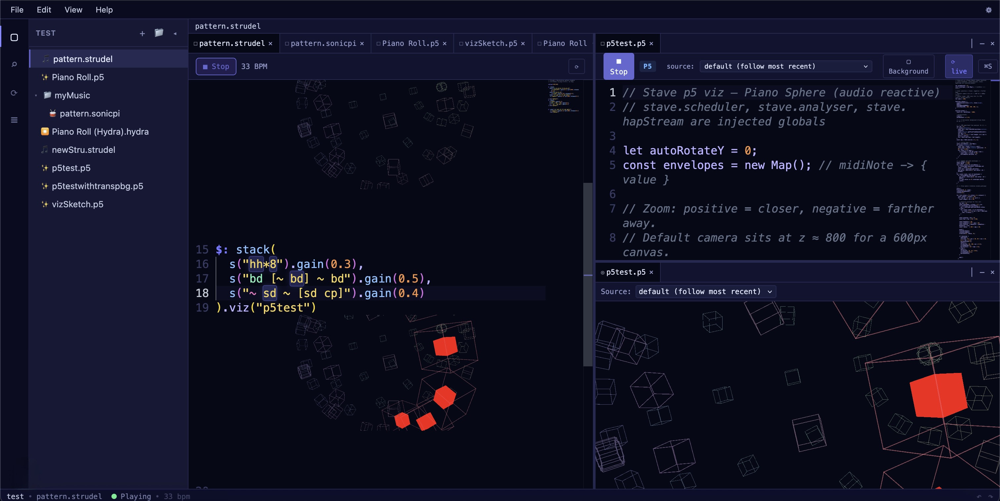

<div align="center">

# Stave Code

**A live-coding studio for [Strudel](https://strudel.cc), [Sonic Pi](https://sonic-pi.net), [p5.js](https://p5js.org), and [Hydra](https://hydra.ojack.xyz) — Monaco-grade editing, inline visualizers, and a real workspace around your music and visuals.**



[](LICENSE)
[](https://www.typescriptlang.org/)
[](https://react.dev/)
[](https://strudel.cc)

</div>

---

## Overview

Live coding deserves a better workspace than a single text box on a webpage.

Stave Code is a full editor for Strudel, Sonic Pi, p5.js, and Hydra — a VS Code-grade shell (tabs, split panes, command palette, search, activity bar, zen mode) wrapped around runtimes that are tightly integrated with `@strudel/core` and `@strudel/webaudio`. No iframe boundary. Your patterns, your visualizers, your project files, all in one place — local-first, with Yjs under the hood so your work keeps working even when the network doesn't.

Inline visualizers are the centerpiece: drop `.viz("spectrum")` after any `$:` pattern and the visualizer renders *between the code lines*, right under the pattern that feeds it. Name a visualizer, reuse it, hot-reload the canvas as you edit — the feedback loop between sound and image stays unbroken.

> **Stave Code** is part of the Stave family. A separate product, **Stave Studio** (node-based synth creation + visual patching), is planned as its own repo when the time is right. This repo stays focused on the text-first live-coding experience.

---

## Try it

**Hosted:** [stave.live](https://stave.live)

**Local:**

```bash
git clone https://github.com/MrityunjayBhardwaj/stave-code.git
cd stave-code
pnpm install
pnpm dev          # http://localhost:3000
```

Prereqs: Node 18+, pnpm 9+.

---

## What's in it

### Editor

| Feature | Status |
|---------|--------|
| VS Code-parity shell — tabs, splits, command palette, activity bar, status bar, zen mode | ✅ |
| Monaco language support — syntax highlighting, bracket matching, autocomplete, hover docs | ✅ |
| Global search — across files, symbols, commands, and history | ✅ |
| Keyboard shortcuts overlay + customizable bindings | ✅ |
| Breadcrumbs, multi-select, tab context menu, settings gear | ✅ |

### Audio

| Feature | Status |
|---------|--------|
| Strudel runtime, no iframe — direct `@strudel/core` + `@strudel/webaudio` integration | ✅ |
| Sonic Pi runtime via `sonicPiWeb` (CDN SynthDefs) | ✅ runtime, per-track analysers pending |
| Active-note highlighting — source chars glow in sync with the scheduler | ✅ |
| Sound autocompletion — `s("…")` suggests every Dirt-Samples and synth name | ✅ |
| Per-track AnalyserNode producer — each `$:` pattern gets its own side-tap | ✅ |
| Runtime error surfacing — scheduler-time errors land in the editor, not just the console | ✅ |

### Visualizers

| Feature | Status |
|---------|--------|
| Inline `.viz("name")` — renders between code lines, under the pattern that feeds it | ✅ |
| Named visualizer files (`.p5`, `.hydra`) — reusable, referenced by name | ✅ |
| Hot-reload on viz file save | ✅ |
| Per-instance crop overrides — two `$:` blocks using the same viz don't clobber each other | ✅ |
| Built-in visualizers — pianoroll, oscilloscope, spectrum analyser, spiral, pitchwheel | ✅ |
| Edit + crop action buttons on every inline zone | ✅ |

### Workspace

| Feature | Status |
|---------|--------|
| Local-first project storage — Yjs + y-indexeddb, no server required | ✅ |
| Multi-file projects with folders, drag-reorder, bracket-aware outline | ✅ |
| Version history — save / restore / delete snapshots, auto-snapshot on idle | ✅ |
| Import / export project as `.zip` | ✅ |
| Theme system — unified tokens, light/dark with instant propagation | ✅ |

### Export

| Feature | Status |
|---------|--------|
| WAV export — offline fast-render via `OfflineAudioContext` (~50× realtime) | ✅ |
| Multi-stem export — render each pattern to a separate WAV in parallel | ✅ |

---

## A tiny example

Open a fresh Strudel file and paste:

```js
$: note("c3 e3 g3 b3").s("sine").gain(0.7).viz("spectrum")
$: s("bd*4, ~ cp").gain(0.9).viz("scope")
```

You get two independent inline visualizers, each side-tapping its own pattern — not the master mix. Click the crop icon on either one to frame the part you care about. Save. It persists.

---

## Repo structure

```
stave-code/
├── packages/
│   ├── editor/          # @stave/editor — React component library (tsup)
│   │   └── src/
│   │       ├── engine/              # Strudel + Sonic Pi runtimes, per-track analysers
│   │       ├── monaco/              # Language, diagnostics, highlighting
│   │       ├── visualizers/         # Inline viz view-zone pipeline
│   │       ├── workspace/           # Yjs-backed file store, tabs, splits
│   │       └── ir/                  # Pattern IR (early — see project docs)
│   └── app/             # Next.js 16 demo app (Turbopack) — what stave.live runs
└── assets/              # Screenshots, branding
```

---

## Embedding

Stave Code is the hosted studio, but the editor core ships as a library too. If you want to drop the editing experience into your own React app:

```tsx
import { StrudelEditor } from '@stave/editor'

export default function App() {
  return (
    <StrudelEditor
      defaultCode={`$: note("c3 e3 g3 b3").s("sine").gain(0.7)`}
      height={400}
      onPlay={() => console.log('playing')}
      onStop={() => console.log('stopped')}
      onError={(err) => console.error(err)}
    />
  )
}
```

### Key props

| Prop | Type | Description |
|------|------|-------------|
| `code` | `string` | Controlled code value |
| `defaultCode` | `string` | Initial uncontrolled code |
| `onChange` | `(code: string) => void` | Code change callback |
| `onPlay` / `onStop` | `() => void` | Playback lifecycle callbacks |
| `onError` | `(err: Error) => void` | Eval and runtime error callback |
| `onExport` | `(blob: Blob) => Promise<string>` | Custom export handler (e.g. CDN upload) |
| `theme` | `'dark' \| 'light' \| StrudelTheme` | Editor theme |
| `engineRef` | `MutableRefObject<StrudelEngine>` | Direct engine access |

---

## Stack

- **Editor** — [Monaco Editor](https://microsoft.github.io/monaco-editor/) via `@monaco-editor/react`, view-zones for inline viz
- **Audio** — [Strudel](https://strudel.cc) (`@strudel/core`, `@strudel/webaudio`, `@strudel/mini`, `@strudel/tonal`, `@strudel/xen`, `@strudel/midi`, `@strudel/soundfonts`), `sonicPiWeb` for Sonic Pi
- **Visualizers** — p5.js, Hydra
- **Persistence** — Yjs + y-indexeddb (local-first CRDT)
- **Framework** — React 19, Next.js 16 (Turbopack)
- **Tooling** — TypeScript, pnpm workspaces, tsup, Vitest, Playwright

---

## Contributing

Contributions are welcome. Read [CONTRIBUTING.md](CONTRIBUTING.md) for the DCO signoff, PR workflow, and what not to commit.

This project follows the [Contributor Covenant Code of Conduct](CODE_OF_CONDUCT.md).

For security vulnerabilities, see [SECURITY.md](SECURITY.md).

## License

GNU Affero General Public License v3.0 — see [LICENSE](LICENSE)
